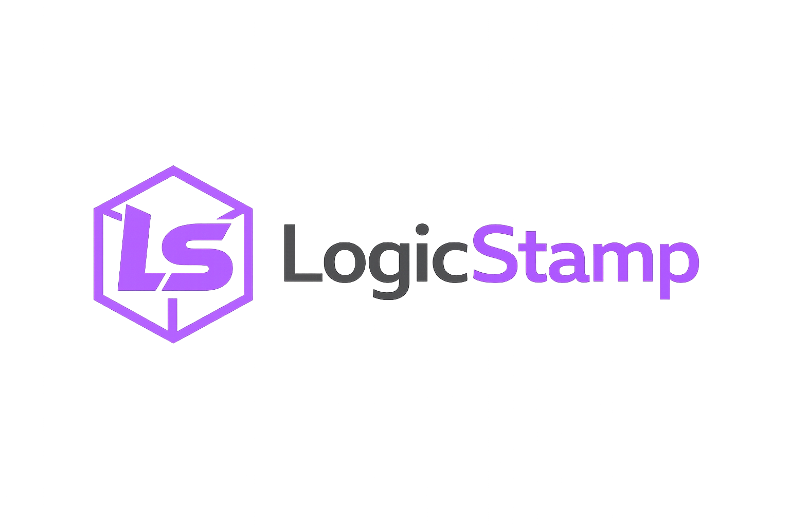

<div align="center">
  <a href="https://logicstamp.dev">
    <picture>
      <source media="(prefers-color-scheme: dark)" srcset="assets/logicstamp-woodmark-dark.png">
      <source media="(prefers-color-scheme: light)" srcset="assets/logicstamp-woodmark-light.png">
      
    </picture>
  </a>

### Deterministic codebase context for AI assistants.

  <small><em>TypeScript · React · Next.js · Vue (TS/TSX) · Express · NestJS</em></small>
  <br/>
  <br/>

  **Structured component contracts for AI - props, hooks, dependencies extracted and organized.**

  <br/>
  <a href="https://github.com/LogicStamp">
    
  </a>

  [](https://www.npmjs.com/package/logicstamp-context)
  
  [](LICENSE)
  
  [](https://github.com/LogicStamp/logicstamp-context/actions)

</div>

## The Problem

AI coding assistants read your source code but don't understand your architecture. They hallucinate prop names, invent dependencies, and miss breaking changes - because raw source code isn't structured context.

**LogicStamp generates deterministic component contracts that:**
- Stay in sync with your code (watch mode auto-regenerates)
- Expose what matters (props, hooks, dependencies) without implementation noise
- Work with any MCP-compatible AI assistant (Claude, Cursor, etc.)


*Context bundles generated and consumed across MCP-powered AI workflows.*

<br/>
<details>
<summary><strong>📑 Table of Contents</strong></summary>

- [Quick Start](#quick-start)
- [Drift Detection](#drift-detection)
- [Why Structured Context?](#why-structured-context)
- [Features](#features)
- [Watch Mode](#watch-mode)
- [How it Works](#how-it-works)
- [MCP Server](#mcp-server)
- [Example Output](#example-output)
- [Installation](#installation)
- [Security](#security)
- [Usage](#usage)
- [Framework Support](#framework-support)
- [Documentation](#documentation)
- [Known Limitations](#known-limitations)
- [Requirements](#requirements)
- [Need Help?](#need-help)
</details>

## Quick Start

**Try it in 30 seconds (no install required):**
```bash
npx logicstamp-context context
```

Scans your repo and writes `context.json` files + `context_main.json` for AI tools.

**What you get:**
- 📁 `context.json` files - one per folder with components, preserving your directory structure
- 📋 `context_main.json` - index file with project overview and folder metadata

**For a complete setup (recommended):**
```bash
npm install -g logicstamp-context
stamp init        # sets up .gitignore, scans for secrets
stamp context
```

> **ℹ️ Note:** With `npx`, run `npx logicstamp-context context`. After global install, use `stamp context`.

## Drift Detection

Compare regenerated context against existing context files:

```bash
stamp context compare          # detect changes
stamp context compare --approve  # update (like jest -u)
```

Useful during development to see what changed. Shows added/removed components, changed props, hooks, dependencies.

> **Note:** Context files are gitignored by default. For CI-based drift detection (comparing against git refs like `main` or `HEAD~1`), see the [roadmap](https://logicstamp.dev/roadmap) - this feature is planned for a future release.

## Why Structured Context?

| Without LogicStamp | With LogicStamp |
|-------------------|-----------------|
| AI reads 200 lines to understand a component | AI reads a 20-line contract |
| Props/hooks inferred (often wrong) | Props/hooks explicit and verified |
| No way to know if context is stale | Watch mode catches changes in real-time |
| Different prompts = different understanding | Deterministic: same code = same contract |

**The key insight:** AI assistants don't need your implementation - they need your *interfaces*. LogicStamp extracts what matters and discards the noise.

### What "Structured" Means

Instead of shipping raw source code to AI:

```typescript
// Raw: AI must parse and infer
export const Button = ({ variant = 'primary', disabled, onClick, children }) => {
  const [isHovered, setIsHovered] = useState(false);
  // ... 150 more lines of implementation
}
```

LogicStamp generates:

```json
{
  "kind": "react:component",
  "interface": {
    "props": {
      "variant": { "type": "literal-union", "literals": ["primary", "secondary"] },
      "disabled": { "type": "boolean" },
      "onClick": { "type": "function", "signature": "() => void" }
    }
  },
  "composition": { "hooks": ["useState"], "components": ["./Icon"] }
}
```

Pre-parsed. Categorized. Deterministic. The AI reads contracts, not implementations.

## ⚡ Features

**Core:**
- **Deterministic contracts** - Same input = same output, auditable in version control
- **Watch mode** - Auto-regenerate on file changes with incremental rebuilds
- **Breaking change detection** - Strict watch mode catches removed props, events, functions in real-time
- **MCP-ready** - AI agents consume context via standardized MCP interface

**Analysis:**
- React/Next.js/Vue component extraction (props, hooks, state, deps)
- Backend API extraction (Express.js, NestJS routes and controllers)
- Dependency graphs with cycle detection
- Style metadata extraction (Tailwind, SCSS, MUI, shadcn)
- Next.js App Router detection (client/server, layouts, pages)

**Developer experience:**
- Per-folder bundles matching your project structure
- Accurate token estimates (GPT/Claude)
- Security-first: automatic secret detection and sanitization
- Zero config required - sensible defaults, works out of the box

## Watch Mode

For development, run watch mode to keep context fresh as you code:

```bash
# Basic watch - regenerate on changes
stamp context --watch

# Strict watch - also detect breaking changes in real-time
stamp context --watch --strict-watch
```

Strict watch catches breaking changes that affect consumers:

| Violation | Example |
|-----------|---------|
| `prop_removed` | Removed `disabled` prop from Button |
| `event_removed` | Removed `onSubmit` callback |
| `function_removed` | Deleted exported `formatDate()` |
| `contract_removed` | Deleted entire component |

**Recommended workflow:**

```
stamp context --watch --strict-watch
         ↓
Real-time breaking change detection
Context always fresh as you code
```

## How it Works

1. **Scan** - Finds all `.ts` and `.tsx` files in your project
2. **Analyze** - Parses components and APIs using TypeScript AST
3. **Extract** - Builds contracts with props, hooks, state, signatures
4. **Graph** - Creates dependency graph showing relationships
5. **Bundle** - Packages context optimized for AI consumption
6. **Organize** - Groups by folder, writes `context.json` files
7. **Index** - Creates `context_main.json` with metadata and statistics

No pre-compilation needed. One command.

> **Tip:** Use `stamp context` for basic contracts. Use `stamp context style` when you need style metadata (Tailwind classes, SCSS selectors, layout patterns).

## MCP Server

For AI assistants with MCP support (Claude Desktop, Cursor, etc.):

```bash
npm install -g logicstamp-mcp
```

Then configure your AI assistant to use the LogicStamp MCP Server.

📋 **See [MCP Getting Started Guide](https://logicstamp.dev/docs/mcp/getting-started)** for setup instructions.

## Example Output

LogicStamp generates structured JSON bundles organized by folder:

```json
{
  "type": "LogicStampBundle",
  "entryId": "src/components/Button.tsx",
  "graph": {
    "nodes": [
      {
        "entryId": "src/components/Button.tsx",
        "contract": {
          "kind": "react:component",
          "interface": {
            "props": {
              "variant": { "type": "literal-union", "literals": ["primary", "secondary"] },
              "onClick": { "type": "function", "signature": "() => void" }
            }
          },
          "composition": {
            "hooks": ["useState"],
            "components": ["./Icon"]
          }
        }
      }
    ],
    "edges": [["src/components/Button.tsx", "./Icon"]]
  }
}
```

📋 **See [docs/schema.md](https://github.com/LogicStamp/logicstamp-context/blob/main/docs/schema.md)** for complete format documentation.

## Installation

```bash
npm install -g logicstamp-context
```

After installation, the `stamp` command is available globally.

## Security

**Automatic Secret Protection**

LogicStamp protects sensitive data in generated context:

- **Security scanning by default** - `stamp init` scans for secrets (API keys, passwords, tokens)
- **Automatic sanitization** - Detected secrets replaced with `"PRIVATE_DATA"` in output
- **Manual exclusions** - Use `stamp ignore <file>` to exclude files via `.stampignore`
- **Safe by default** - Only metadata included; credentials only appear in `--include-code full` mode

> **⚠️ Seeing `"PRIVATE_DATA"` in output?** Review `stamp_security_report.json`, remove hardcoded secrets from source, use environment variables instead.

🔒 **See [SECURITY.md](https://github.com/LogicStamp/logicstamp-context/blob/main/SECURITY.md)** for complete security documentation.

## Usage

```bash
stamp --version                    # Show version
stamp --help                       # Show help
stamp init [path]                  # Initialize project (security scan by default)
stamp ignore <path>                # Add to .stampignore
stamp context [path]               # Generate context bundles
stamp context style [path]         # Generate with style metadata
stamp context --watch              # Watch mode
stamp context --watch --strict-watch  # Watch with breaking change detection
stamp context compare              # Detect changes vs existing context
stamp context validate [file]      # Validate context files
stamp context clean [path]         # Remove generated files
```

### Common Options

| Option | Description |
|--------|-------------|
| `--depth <n>` | Dependency traversal depth (default: 2) |
| `--include-code <mode>` | Code inclusion: `none\|header\|full` (default: header) |
| `--include-style` | Extract style metadata (Tailwind, SCSS, animations) |
| `--format <fmt>` | Output format: `json\|pretty\|ndjson\|toon` (default: json) |
| `--max-nodes <n>` | Maximum nodes per bundle (default: 100) |
| `--profile <p>` | Preset: `llm-chat`, `llm-safe`, `ci-strict`, `watch-fast` |
| `--compare-modes` | Show token cost comparison across all modes |
| `--stats` | Emit JSON stats with token estimates |
| `--out <path>` | Output directory |
| `--quiet` | Suppress verbose output |
| `--debug` | Show detailed hash info (watch mode) |
| `--log-file` | Write change logs to `.logicstamp/` (watch mode) |

📋 **See [docs/cli/commands.md](https://github.com/LogicStamp/logicstamp-context/blob/main/docs/cli/commands.md)** for complete reference.

## Framework Support

| Framework | Support Level | What's Extracted |
|-----------|--------------|------------------|
| **React** | Full | Components, hooks, props, styles |
| **Next.js** | Full | App Router roles, segment paths, metadata |
| **Vue 3** | Partial | Composition API (TS/TSX only, not .vue SFC) |
| **Express.js** | Full | Routes, middleware, API signatures |
| **NestJS** | Full | Controllers, decorators, API signatures |
| **UI Libraries** | Full | Material UI, ShadCN, Radix, Tailwind, Styled Components, SCSS |

> **ℹ️ Note:** LogicStamp analyzes `.ts` and `.tsx` files only. JavaScript files are not analyzed.

## Documentation

**[Full documentation at logicstamp.dev/docs](https://logicstamp.dev/docs)**

- [Getting Started Guide](https://logicstamp.dev/docs/getting-started)
- [Usage Guide](https://github.com/LogicStamp/logicstamp-context/blob/main/docs/usage.md)
- [Monorepo Support](https://github.com/LogicStamp/logicstamp-context/blob/main/docs/monorepo.md)
- [Output Schema](https://github.com/LogicStamp/logicstamp-context/blob/main/docs/schema.md)
- [UIF Contracts](https://github.com/LogicStamp/logicstamp-context/blob/main/docs/uif_contracts.md)
- [Watch Mode](https://github.com/LogicStamp/logicstamp-context/blob/main/docs/cli/watch.md)
- [Troubleshooting](https://github.com/LogicStamp/logicstamp-context/blob/main/docs/usage.md#troubleshooting)

## Known Limitations

LogicStamp is in beta. Some edge cases are not fully supported.

📋 **See [docs/limitations.md](https://github.com/LogicStamp/logicstamp-context/blob/main/docs/limitations.md)** for the full list.

## Requirements

- Node.js >= 18.18.0 (Node 20+ recommended)
- TypeScript codebase (React, Next.js, Vue, Express, or NestJS)

## Need Help?

- **Issues** - [github.com/LogicStamp/logicstamp-context/issues](https://github.com/LogicStamp/logicstamp-context/issues)
- **Roadmap** - [logicstamp.dev/roadmap](https://logicstamp.dev/roadmap)

## License

MIT

---

<details>
<summary>Branding & Attribution</summary>

The LogicStamp Fox mascot and related brand assets are © 2025 Amit Levi. These assets may not be used for third-party branding without permission.
</details>

<details>
<summary>Contributing</summary>

Issues and PRs welcome! See [CONTRIBUTING.md](CONTRIBUTING.md) for guidelines.

This project follows a [Code of Conduct](CODE_OF_CONDUCT.md).
</details>

**Links:** [Website](https://logicstamp.dev) · [GitHub](https://github.com/LogicStamp/logicstamp-context) · [MCP Server](https://github.com/LogicStamp/logicstamp-mcp) · [Changelog](https://github.com/LogicStamp/logicstamp-context/blob/main/CHANGELOG.md)
